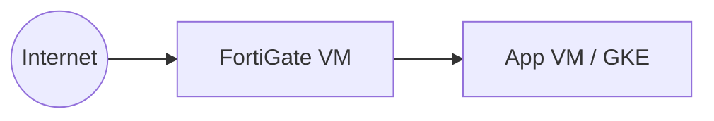
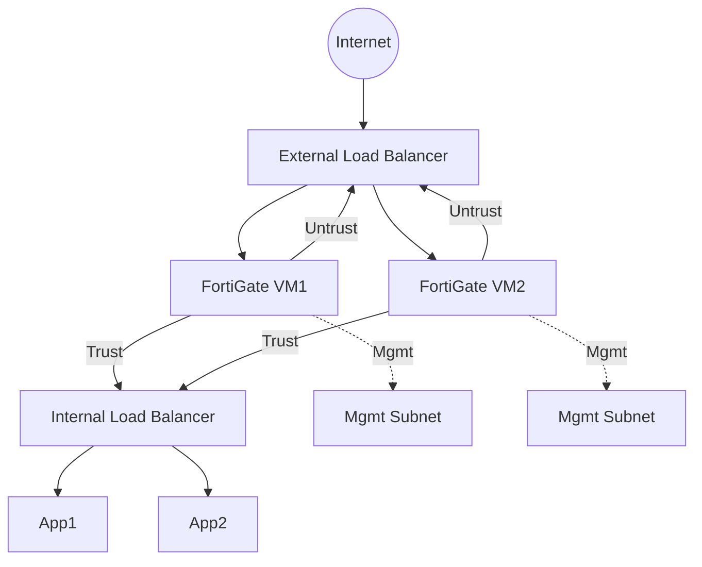
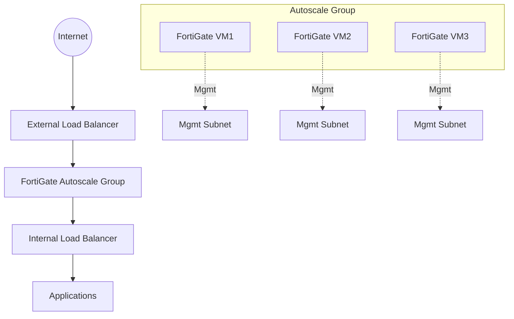
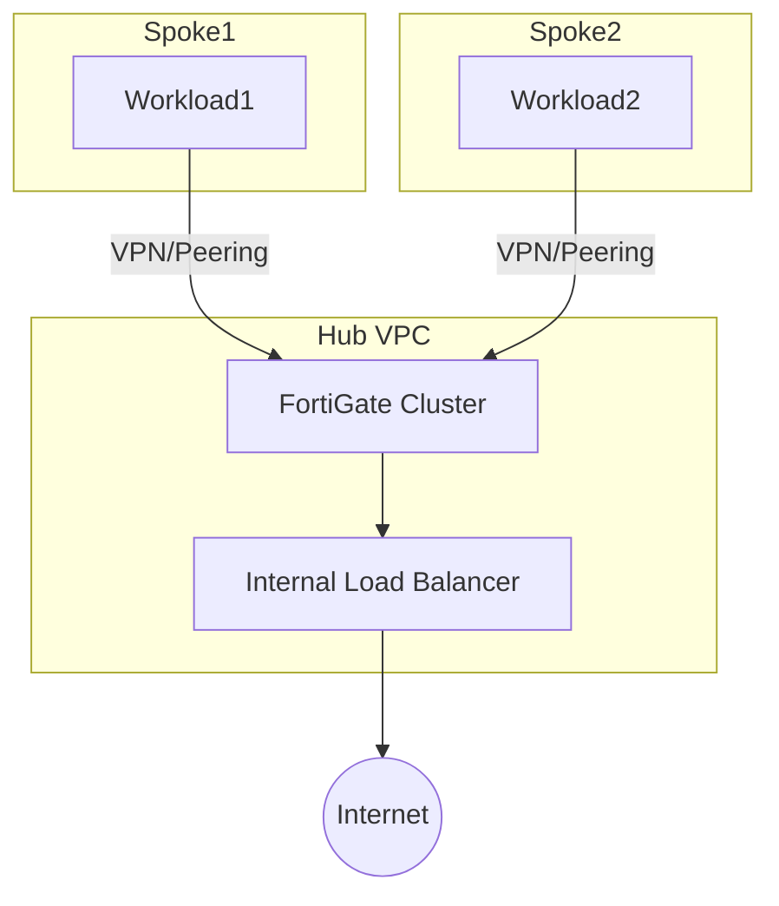
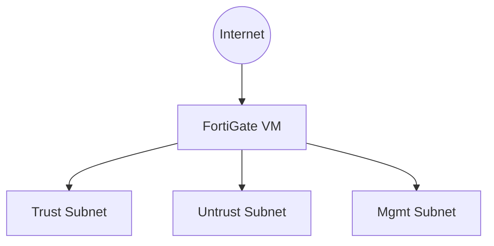
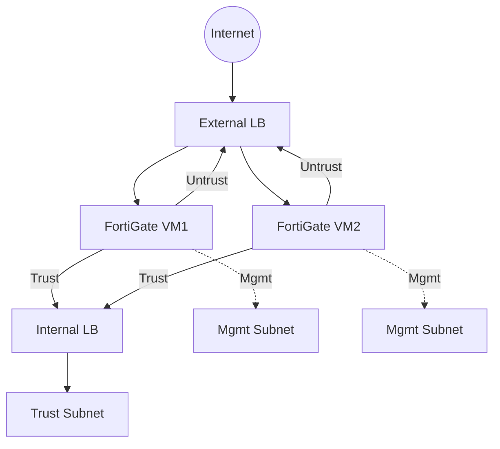

# Fortinet & FortiGate Network Virtual Appliances (NVA)

Fortinet is a global leader in network security, offering a broad portfolio of solutions for enterprise, cloud, and hybrid environments. The flagship product, **FortiGate**, is a Next-Generation Firewall (NGFW) that provides advanced security, threat prevention, and network management capabilities. FortiGate is available as a physical appliance, virtual appliance (NVA), and as a cloud-native service.

---

## What is a FortiGate NVA?
A **FortiGate Network Virtual Appliance (NVA)** is a virtualized firewall and security platform that can be deployed in public clouds (like GCP), private clouds, or on-premises virtualized environments. It delivers the same robust security features as physical FortiGate appliances, including:
- Next-Generation Firewall (NGFW)
- Intrusion Prevention System (IPS)
- VPN (IPsec/SSL)
- Web Filtering & Application Control
- Advanced Threat Protection (ATP)
- SSL Inspection
- Routing & Segmentation
- High Availability (HA)
- Logging & Analytics

---

## Key Elements of FortiGate NVA
- **FortiGate VM**: The core virtual firewall instance.
- **Management Interface**: Used for administration (SSH/HTTPS).
- **Data Interfaces**: For untrust (external) and trust (internal) network segments.
- **Startup Script/Template**: Automates initial configuration.
- **Firewall Policies**: Define traffic rules and security posture.
- **Routing**: Static or dynamic routes for traffic steering.
- **High Availability (HA)**: Active/Passive or Active/Active failover.
- **Logging & Monitoring**: Integration with FortiAnalyzer, Cloud Logging, SIEM.
- **Integration**: With SD-WAN, VPN, and other Fortinet Security Fabric components.

---

## Types of Fortinet/FortiGate NVA Deployments

### 1. Single FortiGate VM (POC, Dev/Test)
- Simple, cost-effective, not highly available.

### 2. HA Pair (Active/Passive or Active/Active)
- Two FortiGate VMs in failover configuration for production-grade resilience.
- Uses External and Internal Load Balancers for redundancy and seamless failover.
- Management interfaces are separated for secure administration.

**Diagram Explanation:**
- **External Load Balancer (ELB):** Distributes inbound traffic to both FortiGate VMs for high availability.
- **FortiGate VM1/VM2:** Deployed in active/passive or active/active mode for failover and redundancy.
- **Internal Load Balancer (ILB):** Handles traffic from FortiGate to internal applications.
- **Mgmt Subnet:** Dedicated management interfaces for secure admin access.

### 3. Autoscaling Group (Advanced, Large Scale)
- Multiple FortiGate VMs managed as a group, scaling with demand (requires advanced setup).
- Load balancers handle both ingress and egress, and health checks ensure only healthy instances receive traffic.

**Diagram Explanation:**
- **Autoscale Group:** FortiGate VMs are automatically added/removed based on load.
- **External/Internal Load Balancers:** Ensure seamless scaling and failover.
- **Mgmt Subnet:** Each VM has a dedicated management interface.

### 4. Hub-and-Spoke / Transit VPC (Centralized Inspection)
- FortiGate cluster in a central VPC inspects traffic from multiple spoke VPCs/projects.
- Spoke VPCs connect via VPN or VPC peering for centralized security enforcement.

**Diagram Explanation:**
- **Hub VPC:** Centralized FortiGate cluster inspects all inter-VPC traffic.
- **Spoke VPCs:** Workloads in separate VPCs connect to the hub for security inspection.
- **VPN/Peering:** Secure connectivity between spokes and hub.
- **Internal Load Balancer:** Distributes traffic to FortiGate cluster.

---

## GCP-Specific FortiGate Deployment Patterns

### Simple GCP Deployment
- Single FortiGate VM with two interfaces (untrust/trust)
- Used for POC, dev, or small workloads

### Advanced GCP Deployment (HA, Load Balancer, Multi-NIC)
- HA pair or autoscale group
- External/Internal Load Balancers for failover and scale
- Separate management, untrust, and trust subnets

**Diagram Explanation:**
- **External/Internal Load Balancers:** Provide redundancy and scale for both ingress and egress traffic.
- **Multi-NIC:** Each FortiGate VM has separate interfaces for management, untrust, and trust.
- **Mgmt Subnet:** Dedicated for secure administration.

---

## Fortinet NVA Elements in This Folder
- `Terraform/` : All Terraform modules, environments, and templates for Fortinet
- `README.md` : This documentation

---

## Subfolder Overview
- **Terraform/**: Contains all code and templates for deploying Fortinet NVAs on GCP, including:
  - `environments/`: Environment-specific configs (e.g., dev, prod)
  - `modules/`: Reusable modules for VPC, subnet, firewall, compute instance
  - `templates/`: Startup scripts and configuration templates

---

## References
- [Fortinet GCP Deployment Guide](https://docs.fortinet.com/document/fortigate-public-cloud/7.2.0/gcp-administration-guide)
- [Fortinet Terraform Examples](https://github.com/fortinet/fortigate-terraform-deploy/tree/main/gcp)

---

*This folder is designed for modular, scalable, and production-grade Fortinet NVA deployments on GCP. Add module, environment, and template details as you build out the solution.*
