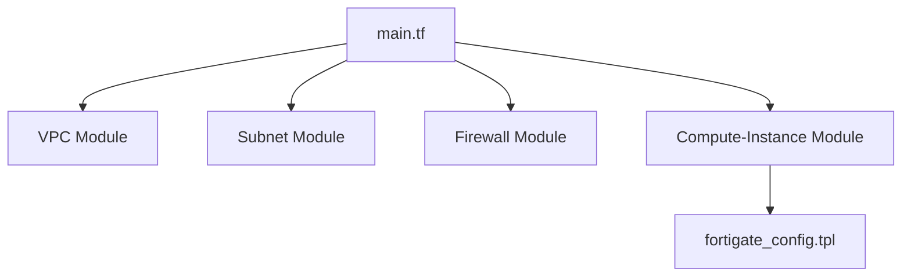

# Fortinet Terraform Modules for GCP

This folder contains all Terraform code, modules, environments, and templates required to deploy Fortinet NVAs (primarily FortiGate) on Google Cloud Platform.

---

## Folder Structure
- `environments/` : Environment-specific configurations (e.g., dev, prod)
- `modules/` : Reusable Terraform modules for VPC, subnet, firewall, compute instance
- `templates/` : Startup scripts and configuration templates for Fortinet appliances

---

## Key Elements
### 1. Environments
- Each subfolder (e.g., `dev/`) contains:
  - `main.tf`: Main deployment logic, wiring modules together
  - `variables.tf`: Input variables for the environment
  - `outputs.tf`: Useful outputs (e.g., VM details, next steps)
  - `terraform.tfvars`: (optional) Environment-specific values

### 2. Modules
- **vpc/**: Creates VPC networks
- **subnet/**: Creates subnets in VPCs
- **firewall/**: Manages GCP firewall rules
- **compute-instance/**: Deploys FortiGate VM(s) with network interfaces and metadata

### 3. Templates
- **fortigate_config.tpl**: Startup script for initial FortiGate configuration (interfaces, routes, policies)

---

## How the Pieces Fit Together

---

## How to Use
1. Edit variables in `environments/dev/variables.tf` and `terraform.tfvars` as needed.
2. Run `terraform init` and `terraform apply` in the environment folder.
3. Outputs will provide FortiGate VM details and next steps for access.

---

## Extending
- Add new modules for additional GCP/NVA features.
- Add new environments (e.g., `prod/`, `test/`).
- Update templates for advanced FortiGate configuration.

---

*This folder is designed for modular, scalable, and production-grade Fortinet NVA deployments on GCP. See the parent README for a full overview of Fortinet and FortiGate concepts.*
