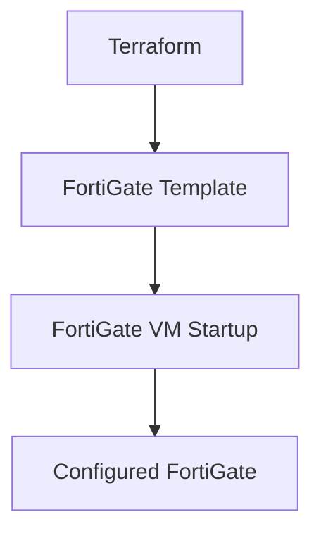

# FortiGate Configuration Templates

This folder contains template files (`.tpl`) used for generating initial and dynamic FortiGate configurations via Terraform's `templatefile()` function. These templates automate the provisioning and configuration of FortiGate NVAs on GCP.

## How Templates Work
- **Purpose:** Templates automate the initial setup of FortiGate devices, ensuring consistent and repeatable configuration.
- **Syntax:** Templates use standard FortiOS CLI commands, with variables referenced as `${variable_name}`. These variables are replaced by Terraform at runtime.
- **Usage:** In your Terraform code, you use the `templatefile()` function to render the template with specific values. Example:
  ```hcl
  metadata = {
    startup-script = templatefile("./templates/fortigate_config.tpl", {
      internal_ip_with_mask = var.fortigate_internal_ip_with_mask
      default_gateway_ip    = var.fortigate_default_gateway
    })
  }
  ```

## What Can Be Set in Templates?
Templates can configure almost any aspect of the FortiGate device, including:
- **Network Interfaces:** Set IP addresses, DHCP/static, allowed management protocols (ping, https, ssh, etc.).
- **Routing:** Add static routes or dynamic routing configuration.
- **Firewall Policies:** Define rules for traffic flow, NAT, and security.
- **User Accounts:** Create or modify admin users.
- **VPNs:** Configure IPsec or SSL VPN settings.
- **Logging:** Set up remote logging or syslog.
- **Other System Settings:** Hostname, DNS, NTP, etc.

## Example: Basic FortiGate Startup Template

`fortigate_config.tpl`:
```tpl
config system interface
  edit "port1"
    set mode dhcp
    set allowaccess ping https ssh
  next
  edit "port2"
    set ip ${internal_ip_with_mask}
    set allowaccess ping https ssh
  next
end

config router static
  edit 1
    set gateway ${default_gateway_ip}
    set device "port1"
  next
end

config firewall policy
  edit 1
    set name "allow-internal-to-internet"
    set srcintf "port2"
    set dstintf "port1"
    set srcaddr "all"
    set dstaddr "all"
    set action accept
    set schedule "always"
    set service "ALL"
    set nat enable
  next
end
```

## Additional Template Examples

### 1. Custom Admin User
`fortigate_admin_user.tpl`:
```tpl
config system admin
  edit "customadmin"
    set password ${admin_password}
    set accprofile "super_admin"
  next
end
```

### 2. Syslog Logging
`fortigate_syslog.tpl`:
```tpl
config log syslogd setting
  set status enable
  set server "${syslog_server_ip}"
  set port 514
end
```

### 3. IPsec VPN Example
`fortigate_ipsec.tpl`:
```tpl
config vpn ipsec phase1-interface
  edit "vpn-to-branch"
    set interface "port1"
    set peertype any
    set remote-gw ${remote_gateway_ip}
    set psksecret ${psk_secret}
  next
end
```


## Template Syntax
- `${variable}`: Placeholder for values injected by Terraform's `templatefile()` function.
- Standard FortiOS CLI configuration blocks (e.g., `config system interface`, `config firewall policy`).

## Design Structure (Mermaid Diagram)


## Best Practices
- Use variables for all environment-specific values.
- Keep templates modular (one template per function if possible).
- Document each template and its variables.
- Test templates in a non-production environment before use.

---
*Add more templates as needed for your deployment scenarios. Each template should be documented and parameterized for flexibility.*
